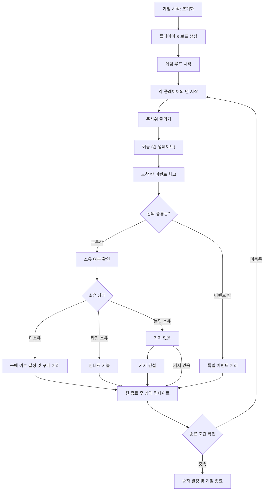

```mermaid
flowchart TD
    A[게임 시작: 초기화] --> B[플레이어 & 보드 생성]
    B --> C[게임 루프 시작]
    C --> D[각 플레이어의 턴 시작]
    D --> E[주사위 굴리기]
    E --> F["이동 (칸 업데이트)"]
    F --> G[도착 칸 이벤트 체크]
    G --> H{"칸의 종류는?"}
    H -- 부동산 --> I["소유 여부 확인"]
    I --> J{"소유 상태"}
    J -- 미소유 --> K["구매 여부 결정 및 구매 처리"]
    J -- 타인 소유 --> L["임대료 지불"]
    J -- 본인 소유 --> Z["기지 없음"] --> M["기지 건설"]
    Z -- 기지 있음 --> O
    H -- 이벤트 칸 --> N["특별 이벤트 처리"]
    K --> O["턴 종료 후 상태 업데이트"]
    L --> O
    M --> O
    N --> O
    O --> P{"종료 조건 확인"}
    P -- 미충족 --> D
    P -- 충족 --> Q["승자 결정 및 게임 종료"]
```

